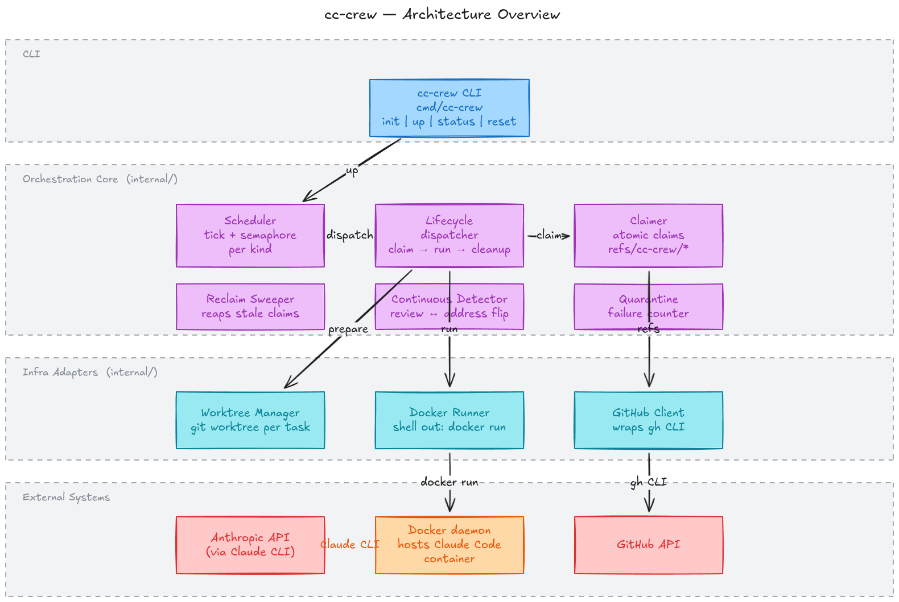

# cc-crew

Run multiple [Claude Code](https://docs.anthropic.com/en/docs/claude-code) sessions locally, each acting as a different role with its own remote service access (GitHub account, Claude auth, etc.). Built on `node:lts-alpine` with `git`, `bash`, `gh`, and the Claude Code CLI pre-installed. Spin up one container per persona — each gets its own `GH_TOKEN`, `CLAUDE_CODE_OAUTH_TOKEN`, git identity, and scoped permissions — then fire `claude -p "..."` commands at any of them from the host.



## Features

- Lightweight Alpine base
- `git`, `bash`, and `gh` (GitHub CLI) included
- Claude Code installed globally via npm
- Onboarding pre-seeded — no interactive theme/trust prompts on first run
- Stays alive via `tail -f /dev/null` so you can `docker exec` into it

## Build

```bash
docker build -t claude-code .
```

## Authentication

### Claude Code

Two options, depending on your plan.

**Max / Pro subscription (recommended)** — generate a long-lived OAuth token on any machine with a browser where you're already logged in:

```bash
claude setup-token
```

Pass the resulting token as `CLAUDE_CODE_OAUTH_TOKEN`. Usage counts against your subscription.

**API key** — pass `ANTHROPIC_API_KEY`. Bills per-token against API credits; does **not** use your Max/Pro subscription.

### GitHub

Set `GH_TOKEN` to a token for the account you want to operate as. Each GitHub account = its own token.

**Fine-grained token scoped to personal repos only** (recommended over classic PATs):

1. Go to https://github.com/settings/personal-access-tokens/new
2. **Resource owner:** your own username (not any org) — this alone excludes org repos
3. **Repository access:** *All repositories* or *Only select repositories*
4. **Repository permissions:** Contents, Pull requests, Issues = Read and write; Workflows = Read and write (if touching `.github/workflows/`)
5. Leave **Account permissions** at "No access"

Classic PATs are account-wide and include all orgs you belong to — avoid for scoped use.

## Run

Start the container detached with all auth wired in:

```bash
docker run -d --name claude \
  -e CLAUDE_CODE_OAUTH_TOKEN=sk-ant-oat01-... \
  -e GH_TOKEN=github_pat_... \
  -e GIT_AUTHOR_NAME="Your Name" \
  -e GIT_AUTHOR_EMAIL="you@example.com" \
  -e GIT_COMMITTER_NAME="Your Name" \
  -e GIT_COMMITTER_EMAIL="you@example.com" \
  -v "$PWD":/workspace \
  claude-code
```

Wire `gh` as git's credential helper (once per container) so `git push` over HTTPS works:

```bash
docker exec claude gh auth setup-git
```

## Sending commands

From the host:

```bash
docker exec claude claude -p "explain main.go"
docker exec claude claude -p --dangerously-skip-permissions "run the tests and summarize"
```

`claude -p` is print/non-interactive mode — ideal for scripting. `--dangerously-skip-permissions` lets Claude run tools (bash, edits) without per-use approval; the container's `bypassPermissionsModeAccepted` is pre-seeded so this never prompts.

Optional alias on the host:

```bash
alias claude='docker exec claude claude'
```

## Scoped permissions (alternative to `--dangerously-skip-permissions`)

If you'd rather allow a specific set of commands instead of bypassing permissions entirely, mount a `settings.json` at `/root/.claude/settings.json`. Per-persona starters live under `personas/<role>/settings.json` — e.g. `personas/reviewer/settings.json` allows common `gh` and `git` operations and denies destructive ones (force push, hard reset, `rm -rf`).

```bash
docker run -d --name claude \
  -e CLAUDE_CODE_OAUTH_TOKEN=... \
  -e GH_TOKEN=... \
  -e GIT_AUTHOR_NAME="Your Name" \
  -e GIT_AUTHOR_EMAIL="you@example.com" \
  -e GIT_COMMITTER_NAME="Your Name" \
  -e GIT_COMMITTER_EMAIL="you@example.com" \
  -v "$PWD/personas/reviewer/settings.json:/root/.claude/settings.json:ro" \
  -v "$PWD":/workspace \
  claude-code
```

Then drop `--dangerously-skip-permissions` from your `claude -p` calls. Allow-listed commands run directly; anything else will prompt and hang in `-p` mode — that's the signal to add it to the persona's `settings.json`.

**Pattern syntax:** `Bash(cmd:*)` matches any args, `Bash(cmd)` requires exact match. `deny` rules override `allow`. Edit `settings.json` and restart the container to pick up changes.

## Personas (persistent memory)

A persona bundles the files a role needs: a `CLAUDE.md` (Claude Code loads
this as user-level memory on every invocation) and a `settings.json` of
scoped permissions. Each lives under `personas/<role>/` — see
`personas/reviewer/` for a starter.

```bash
docker run -d --name claude-reviewer \
  -e CLAUDE_CODE_OAUTH_TOKEN=... \
  -e GH_TOKEN=... \
  -v "$PWD/personas/reviewer/CLAUDE.md:/root/.claude/CLAUDE.md:ro" \
  -v "$PWD/personas/reviewer/settings.json:/root/.claude/settings.json:ro" \
  -v "$PWD":/workspace \
  claude-code
```

Swap to a different persona by stopping the container and mounting a
different directory. Edits to the host files take effect on the next
`claude -p` call — no rebuild needed.

## Working directories

`WORKDIR` defaults to `/workspace`. Control what lives there with `-v`, and override per-command with `-w`:

```bash
# Single project
docker run -d --name claude -v /home/you/myproject:/workspace ... claude-code

# Multiple projects, switch per command
docker run -d --name claude -v /home/you/Work:/workspace ... claude-code
docker exec -w /workspace/projectA claude claude -p "..."
docker exec -w /workspace/projectB claude claude -p "..."
```

Files edited by Claude land in your bind-mounted host directory.

## Switching GitHub accounts

No state to clear — stop the container and start a new one with a different `GH_TOKEN`:

```bash
docker rm -f claude
docker run -d --name claude -e GH_TOKEN=<other-token> ... claude-code
```

Verify which account is active:

```bash
docker exec claude gh auth status
docker exec claude gh api user -q .login
```

## Teardown

```bash
docker rm -f claude
```

## Orchestrator: `cc-crew up` / `status` / `reset`

cc-crew includes a Go CLI that watches a GitHub repo and dispatches
this image automatically: issues labeled `claude-task` get picked up
by the implementer persona, PRs labeled `claude-review` by the reviewer.

### Build

```bash
make build                 # produces ./cc-crew
```

### Run

From inside a clone of the target repo:

Before the first `up`, run `cc-crew init` once per repo to create the nine lifecycle labels on the remote (`claude-task`, `claude-processing`, `claude-done`, `claude-review`, `claude-reviewing`, `claude-reviewed`, `claude-address`, `claude-addressing`, `claude-addressed`). It's safe to re-run — already-present labels are reported and skipped.

```bash
export GH_TOKEN_IMPLEMENTER=github_pat_...
export GH_TOKEN_REVIEWER=github_pat_...
export GH_TOKEN=$GH_TOKEN_IMPLEMENTER      # used for orchestrator's own API calls
export CLAUDE_CODE_OAUTH_TOKEN=sk-ant-oat01-...
export IMPLEMENTER_GIT_NAME="implementer-bot"
export IMPLEMENTER_GIT_EMAIL="impl@example.com"
export REVIEWER_GIT_NAME="reviewer-bot"
export REVIEWER_GIT_EMAIL="rev@example.com"

./cc-crew init                     # create the 9 cc-crew labels on the remote (idempotent)
./cc-crew up                       # foreground; Ctrl-C to stop
./cc-crew up --max-implementers 3 --max-reviewers 2
./cc-crew status                   # in another terminal; stateless
./cc-crew reset                    # dry run
./cc-crew reset --yes              # actually clean up cc-crew state
```

See `docs/superpowers/specs/2026-04-16-cc-crew-orchestrator-design.md`
for the full design.
